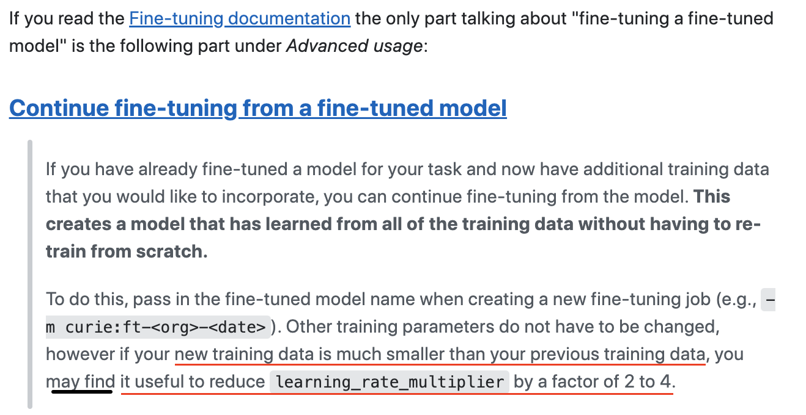
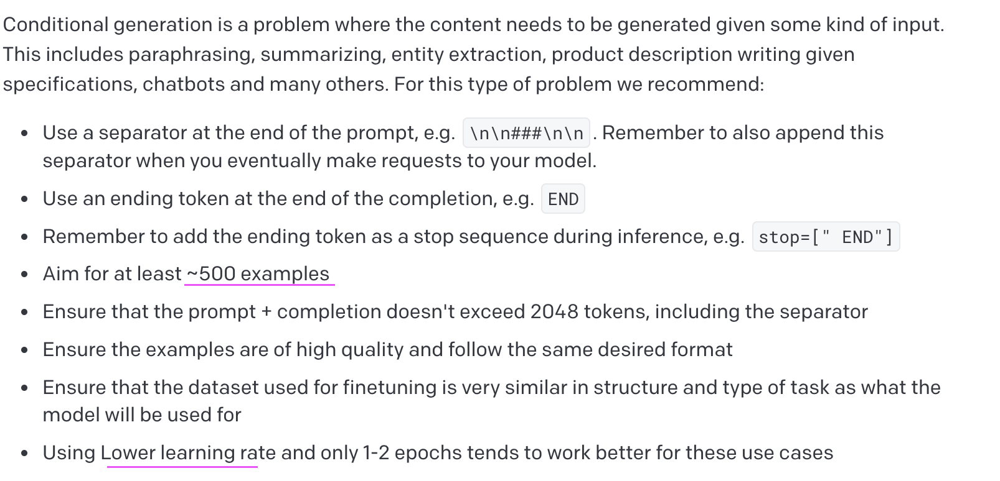
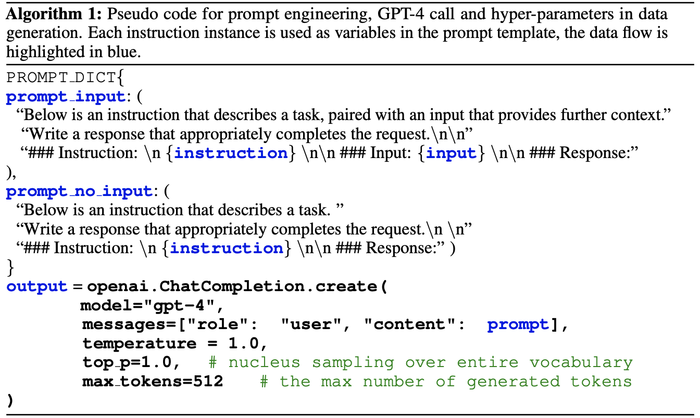

# GPT-OpenAI FineTuning in Limited Annotation Data

### References

- https://platform.openai.com/docs/guides/fine-tuning/preparing-your-dataset
- 

### Finetuning setup

In the note, we have addressed the issues of GPT-OpenAI Fine-Tuning (e.g. davinci finetuning model) in industry company where there is a lack of annotation human resource in short time.

In an official announcement from OpenAI, there is no formal way to do continous fine-tuning model. So in our view, sofar there are 2 ways: at 1st fine-tuning: dataset-1; 2nd fine-tuning: dataset-2

    - 1st fine-tuning: model-A = dataset-1 + base model OpenAI

    - 2nd fine-tuning:

    Option A. model-B = OpenAI base model + [dataset-1, dataset-2]

    Option B. model-B =model-A + dataset-2

For option A, we spend a lot of money if there are additional products/features need learnt. This way is not what I want.

For option B, we think we can save money and time for next fine-tuning. But there are some drawbacks:

    - It's hard to fine-tuning for next by next dataset with variable size => the fix suggestion can be

- There something to be care: how much learning_rate_multiplier should increase/descrease although a range of value suggested as [0.02, 0.2]

### Dataset and Prompting (Generative Usecase)

One sample of instruction prompting

> "prompt":
> Summary: `
`\n\n
> Specific information:`<for example order details in natural language>`\n\n
> ###\n\n
> Customer: `<message1>`\n
> Agent: `<response1>`\n
> Customer: `<message2>`\n
> Agent:
>
> "completion":
> " `<response2>`\n"

# Instruct-Net Approach

### References

- https://arxiv.org/pdf/2304.03277.pdf?trk=public_post_comment-text

Summary: Instruct data generated by LLMs can demonstrate to well-learn for a new task.

### Methodology

##### Data Collection

- Collect the GPT family completion from a given instruct samples generated by LLM models
  - 
  - For example, instructions collected in Alpca model. GPT4 answer is provided for each.
  - Dataset evaluation: after collecting dataset from 3 models, ask GPT4 to score [1,10] its response per each dataset => use this dataset to train the reward model
  - How to qualify the gap between 3 datasets as template: {instruction, input, output}

##### Self-Instruct Tuning

- Train the predefine model with self-instruct dataset collected in Data Collection section

##### Rewards Model

- In RLHF, reward modeling is formulated as regression task, to predict the value given a prompt and reponse in a such
  - Per each instance, there are a pair of low/high score $x = (h_{l}, h_{h}) $,
  - Objective training is $min log(sigmoid(r_{\theta}(x, y_{h}) - r_{\theta}(x, y_{l})))$

##### Human Alignment Evaluation

- Anthropic at el. defined alignment by three conditions helpful, honest, harmless (HHH)
- Helpfulness: model responsed the question accurately that helps human to achieve their goals
- Honesty: provide true information, and express its uncertainty which avoid misleading to human intent.
- Harmlessness: not harm to humans (e.g. generate toxic/hate speech/violence)

Appoach A as service: use Amazon Mechanical Turk

Apprach B as automatic tool: use LLM crowdsourcing as type of Amazon Mechanical Turk

    - Use chatGPT & GPT4 ask to rate the score from [1,10] for each response by fine-tuning models.
